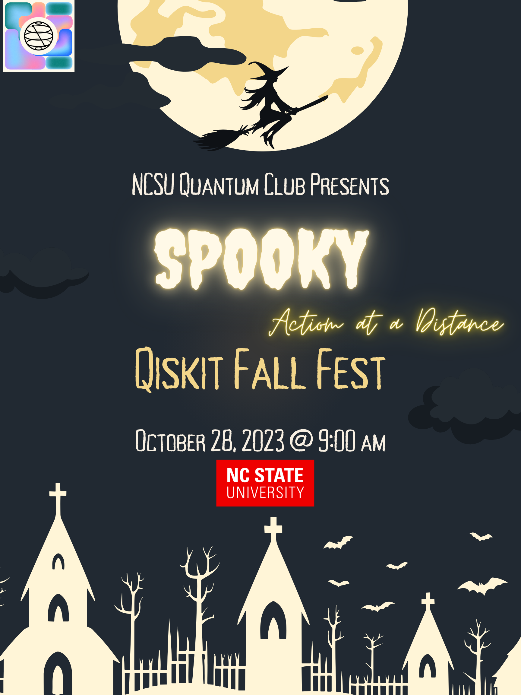

# Qiskit Fall Fest (Halloween edition)
At NCSU Oct 28th 2023 9:00AM US ET

Brought to you by the Quantum Club https://quantuminformationclub.wordpress.ncsu.edu/

We are thrilled to host a Fall Fest event at NCSU! The Qiskit Fall Fest is a collection of quantum computing events on college campuses around the world and we are lucky to be selected. 

## Schedule

* 09:00 AM Dr. Yuan Liu (NCSU) A Quantum Information Science Perspective on Quantum Chemistry.
* 10:00 AM Dr. Ted Yoder (IBM): Simulating quantum error-correction and new qLDPC codes.
* 11:00 AM IBM-Q Tutorials
* 12:00 PM Lunch - Pizza... Yumm!
* 01:00 PM Dr. Nick Bronn (IBM): Outlook for Quantum Computing with Superconducting Qubits.
* 02:00 PM Dr. Jack Morgan: Quantum Algorithms for Financial Models in a Regime Switching Economy.

## Zoom Invite 
https://ncsu.zoom.us/j/94056828369

A presentation of the [Detailed Schedule](materials/QiskitFallFest23.pdf)
 
## Tutorials

There is a Watch me setup video for the IBM-Q console:

* See 
* Setup 

## Our Posters

